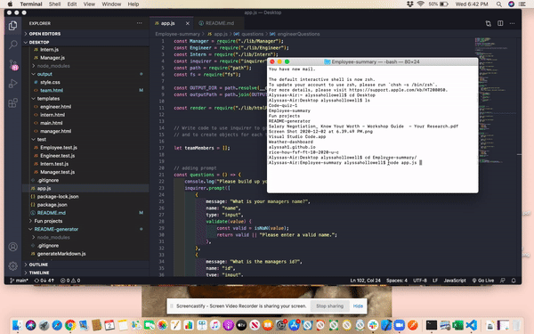
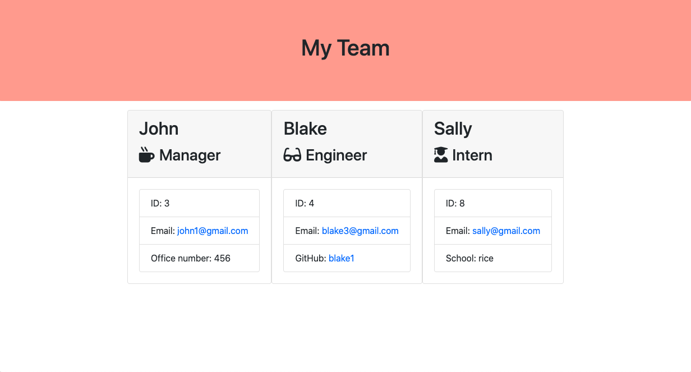

# Employee-summary

# Created by: Alyssa Hollowell

# Requirements 
Functional application.
GitHub repository with a unique name and a README describing the project.
User can use the CLI to generate an HTML page that displays information about their team.
All tests must pass.

# Description
This application will prompt the user for information about the team manager and about the team members. The user can input an ID number, email address GitHub username and school. The members must be an engineer, intern or manager. When the user finishes creating the team the application will create an HTML file. 

# Helpful links

# Questions
If you have any questions please use the contacts down below:

#### Email address: alyssa.hollowell2@gmail.com
#### GitHub account: alyssah1

